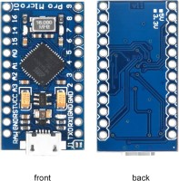

# Crusader Industries Control System 🕹️
> Switch control for space sims, designed for Star Citizen

**DO NOT FLASH CURRENTLY - Still in development**

- [Crusader Industries Control System 🕹️](#crusader-industries-control-system-️)
    - [What works so far](#what-works-so-far)
    - [Button Layout](#button-layout)
    - [PCB Info](#pcb-info)
    - [Hardware](#hardware)
- [Software](#software)
- [Assembly Notes](#assembly-notes)
- [Credits](#credits)
    - [Author](#author)

### What works so far
Currently, this project includes STLs for 3D printing a box to contain a PCB and switches wired in with JST connectors. The base is designed to stop printing midway to place washers in as weights.

### Button Layout
There is an Illustrator file for sketching out the layout of the lid.

### PCB Info
The PCB was designed in Fusion360, as was the lid to the box, and ordered through [JLCPCB](https://jlcpcb.com/). There are cutouts in the PCB to fit the current switches.

### Hardware
This is the hardware used:
- Adafruit Pro Micro
-
[From Sparkfun](https://www.sparkfun.com/products/12640)

[From Amazon](https://www.amazon.com/OSOYOO-ATmega32U4-arduino-Leonardo-ATmega328/dp/B012FOV17O)

# Software
# Assembly Notes
# Credits
### Author
- [@colintravis](https://www.colintravis.com)
